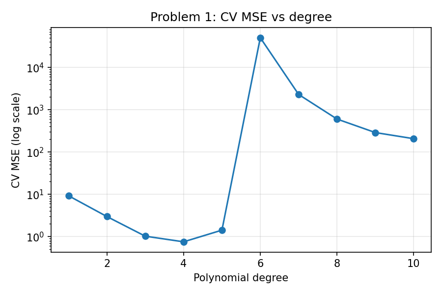
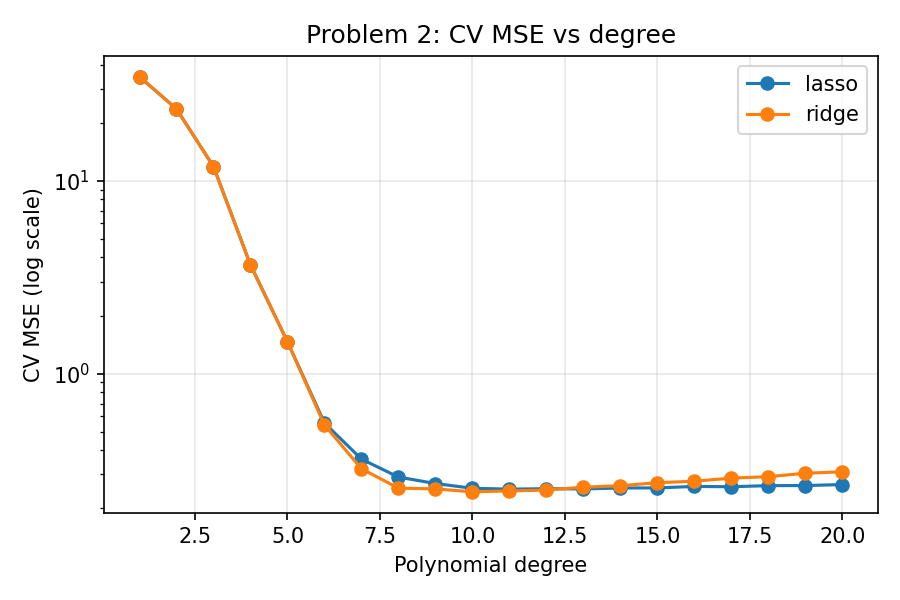

# 1. Executive Summary

This report models two datasets with polynomial regression (Roll No: IMT2024040). Problem 1 (var1) predicts a steam-turbine output y from six operating inputs, searching polynomial degrees 1-10. Problem 2 (var2) predicts y from three spatial coordinates of a subterranean thermal reservoir, searching degrees 1-20. Degrees were selected with 5-fold shuffled cross-validation, using Mean Squared Error (MSE) as the selection criterion and R² as a supporting metric.

Problem 1 selected **degree 4** with ordinary least squares (CV MSE 0.7528, CV R² 0.9285). Problem 2 selected **degree 10 with Ridge regression** (alpha = 1.0, CV MSE 0.2439, CV R² 0.9946). Final models were refit on all 1000 training rows to predict the 1000 test rows, saved as `IMT2024040-pred_var1.csv` and `IMT2024040-pred_var2.csv`.

# 2. Problem 1: Steam Turbine Optimization (var1)

## 2.1 Exploratory analysis

The training set has 1000 rows, six inputs (x1-x6) and a target y, with no missing values. All inputs lie in [-1, 1] with means near 0 and standard deviations of about 0.71-0.72, so they are already similar in scale; they were still standardized so that polynomial terms stay well-conditioned. The target ranges from about -10.3 to 13.6 (mean 0.74, std 3.26). A straight-line fit explains only about 12% of the variance (CV R² = 0.124), which indicates strongly non-linear behaviour and interactions between inputs. <<Optional: add one sentence about any correlations or patterns you saw in the data.>>

## 2.2 Method

For each degree d from 1 to 10, inputs were standardized, expanded into all polynomial terms up to degree d (including interaction terms), and fitted by ordinary least squares. Each degree was scored with 5-fold shuffled cross-validation (seed 42), with scaling fitted inside each fold to avoid data leakage. The number of terms grows quickly: 83 at degree 3, 209 at degree 4, 461 at degree 5, 923 at degree 6 and 8,007 at degree 10. Each CV training fold has only 800 rows.

## 2.3 Results

| Degree | CV MSE | CV R² | Train R² |
|---:|---:|---:|---:|
| 1 | 9.2505 | 0.1241 | 0.1511 |
| 2 | 2.9804 | 0.7190 | 0.7377 |
| 3 | 1.0232 | 0.9034 | 0.9265 |
| **4** | **0.7528** | **0.9285** | 0.9666 |
| 5 | 1.4227 | 0.8653 | 0.9892 |
| 6 | 50,450.6 | -4696.85 | 1.0000 |
| 7 | 2,297.6 | -213.45 | 1.0000 |
| 8 | 602.6 | -55.45 | 1.0000 |
| 9 | 288.6 | -26.04 | 1.0000 |
| 10 | 206.8 | -18.38 | 1.0000 |

{width=60%}

## 2.4 Degree selection rationale

Degree 4 has the lowest CV MSE (0.7528 ± 0.084) and the highest CV R² (0.9285). Degrees 1-2 underfit: both training and validation error are high because the model cannot represent the curvature. At degree 5 the model begins to overfit: training R² rises to 0.989 while CV R² falls to 0.865. From degree 6 onward the number of terms (923+) exceeds the 800 training rows in each fold, so unregularized least squares fits the training data perfectly (train R² = 1) but generalizes extremely badly (CV MSE in the hundreds to tens of thousands). Degree 4 balances flexibility against variance, so it was selected.

# 3. Problem 2: Subterranean Thermal Reservoir Mapping (var2)

## 3.1 Spatial mapping analysis

The training set has 1000 rows with three spatial coordinates x1-x3 (all in [-1, 1], means near 0, std about 0.67-0.68) and a target y ranging from about -30.2 to 39.2 (mean 2.04, std 6.77), with no missing values. The coordinates are therefore mapped onto a normalized cube, and y is the measured quantity at each point. A linear model explains only about 24% of the variance (CV R² = 0.245), so the field varies non-linearly through space. <<Optional: add one sentence about the shape of the field, e.g. smooth gradients or localized peaks, if you plotted it.>>

## 3.2 High-degree polynomial search (1-20)

With three inputs, the number of polynomial terms grows as 9 at degree 3, 285 at degree 10 and 1,770 at degree 20. The higher degrees have more terms than the 800 rows available in each CV training fold, so unregularized fitting would overfit as it did in Problem 1.

## 3.3 Regularization strategy

For every degree, the pipeline was: standardize inputs, expand to polynomial terms, standardize the expanded terms (so the penalty treats all terms equally), then fit a regularized linear model. Two models were compared: **Ridge** (L2 penalty, shrinks all coefficients) and **Lasso** (L1 penalty, can set coefficients exactly to zero). For each degree and model the penalty strength alpha was tuned by 5-fold CV (Ridge: 1e-3 to 1e3; Lasso: 1e-3, 1e-2, 1e-1; Lasso used max_iter = 5000 and tol = 1e-3 for speed).

## 3.4 Results

| Degree | Best model | alpha | CV MSE | CV R² |
|---:|---|---:|---:|---:|
| 1 | Ridge | 10 | 34.5663 | 0.2446 |
| 2 | Ridge | 10 | 23.5326 | 0.4855 |
| 3 | Ridge | 1 | 11.8332 | 0.7393 |
| 4 | Ridge | 0.01 | 3.6588 | 0.9190 |
| 5 | Lasso | 0.001 | 1.4621 | 0.9675 |
| 6 | Ridge | 0.01 | 0.5418 | 0.9881 |
| 7 | Ridge | 0.1 | 0.3212 | 0.9929 |
| 8 | Ridge | 0.1 | 0.2549 | 0.9944 |
| 9 | Ridge | 0.1 | 0.2526 | 0.9944 |
| **10** | **Ridge** | **1** | **0.2439** | **0.9946** |
| 12 | Ridge | 1 | 0.2491 | 0.9945 |
| 15 | Lasso | 0.001 | 0.2557 | 0.9943 |
| 20 | Lasso | 0.001 | 0.2661 | 0.9941 |

{width=60%}

## 3.5 Degree selection rationale

Error falls steeply from degree 1 (MSE 34.6) to degree 8 (MSE 0.25), so the reservoir field needs a fairly flexible polynomial. The curve is flat from degrees 8 to 12, and the lowest CV MSE is at **degree 10 with Ridge (alpha = 1)**: MSE 0.2439, R² 0.9946. Beyond degree 12 Ridge's error rises slowly (0.2491 at degree 12 to 0.3099 at degree 20), showing mild variance growth. Lasso is flatter at high degrees (0.2519 at degree 11 to 0.2661 at degree 20) because it discards unhelpful terms, but it never beats Ridge at degree 10. Differences among degrees 8-13 are small (about 0.01 in MSE), so degree 10 is chosen as the lowest-error and simplest of the near-equivalent options. Lasso mostly selected the smallest alpha in its grid, so a lower or finer grid might improve it slightly.

# 4. Model Validation and the Overfitting/Underfitting Trade-off

- **Underfitting (high bias):** low degrees cannot capture the curvature or interactions. In both problems training and validation error are high together (var1 degree 1: train R² 0.15, CV R² 0.12).
- **Overfitting (high variance):** high degrees fit noise. In var1, train R² climbs to 1.0 while CV R² collapses to large negative values from degree 6.
- **Regularization controls variance:** the same situation in var2 (up to 1,770 terms versus 800 rows per fold) stays stable, with CV MSE staying between 0.24 and 0.31 up to degree 20. This is the clearest demonstration of why penalized regression is needed at high degree.
- **Validation protocol:** 5-fold shuffled CV with a fixed seed (42); scaling fitted inside each fold; hyperparameters (alpha) tuned by CV; the test set was never used for model selection.
- **Limitation:** CV MSE is an estimate with some variation (var1 degree 4 std = 0.084), so near-tied degrees cannot be separated with certainty.

# 5. Summary and Conclusion

| Problem | Inputs | Degrees searched | Selected model | CV MSE | CV R² |
|---|---:|---|---|---:|---:|
| var1 | 6 | 1-10 | OLS, degree 4 | 0.7528 | 0.9285 |
| var2 | 3 | 1-20 | Ridge, degree 10, alpha = 1 | 0.2439 | 0.9946 |

Both problems needed non-linear models: a linear fit explained only 12% (var1) and 24% (var2) of the variance. For var1, plain least squares works only at low degree, and degree 4 is the sweet spot before overfitting begins. For var2, regularization allowed a rich degree-10 surface to be fitted reliably and kept even degree-20 models stable. Possible improvements are a finer alpha grid, nested cross-validation for a less biased error estimate, and applying Ridge to var1 to see whether it improves on degree 4.

**Code and data:** <<paste your GitHub repo URL here>>